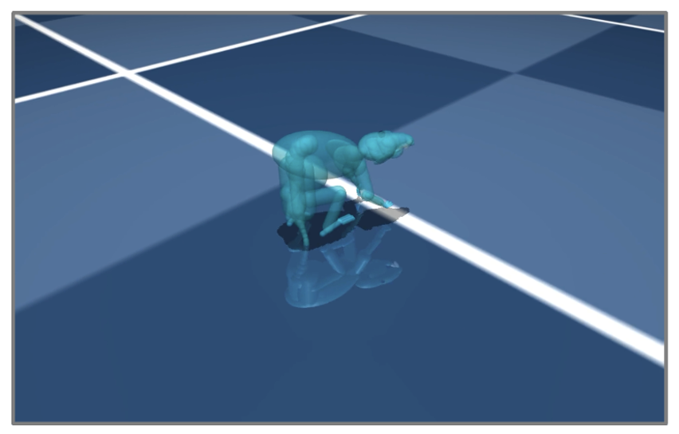

# Kaiwen (Kevin) Bian

My name is Kaiwen (Kevin) Bian and I am a undergraduate student at UCSD double majoring in **Data Science** & **Cognitive Behavoral Neuroscience** and minoring in **Mathamatics**. I am passionate about finding bridges between Data Science and Neuroscience through forms of algorithm and machine learning to help both communities better understand the machines and ourselves. I am fluent in both Chinese and English, and open- minded for new ideas and learning opportunities.

**Email**: [kaiwenbian107@gmail.com](kaiwenbian107@gmail.com)

-- [Resume](assets/Kaiwen%20Bian%20Resume%202024:3:31.pdf) -- [CV](assets/Kaiwen%20Bian%20CV%202024:March:31.pdf) -- [Github](https://github.com/KevinBian107) -- [Linkedin](https://www.linkedin.com/in/kbian107/) --

# Interships & Research

## UCSD CSE & Salk Institute Student Researcher
> The modern paradigm of machine learning puts the emphasis on the end result, rather than the learning process, and overlooks a critical characteristic of human learning: that it is robust to changing tasks and sequential experience.

I am currently reseraching into the theoritical aspects of **Continual Learning** with advising from professor [Sichun Gao](https://scungao.github.io/) from UCSD Computer Science & Engineering Department and professor [Talmo Pereira](https://talmopereira.com/) from Salk Institute. I try to frame the general problem of Continual Learning from the perspective of Reinforcement Learning & Cognivite Neuroscience, hoping to develope algorithms that utilize the same strategies of "how we learn" onto a artificial agent.

## Salk Institute Research Intern
I am currently working as a undergraduate research intern at [Talmo's Lab](https://talmolab.org/) in the Salk Institute. we are working on the the VNL project, a collaboration between Salk Institute and Harvard University aiming to use advance **Deep Reinforcement Learning** method such as **Imitation Learning** to create working piepliens for computational models of the brain using GPU accelerated JAX & Brax.

    

> Abstarct Deep Imitation Learning Idea (borrowed from Talmo's Lab VNL slides)

We aim to create pipelines with architectures and learning alogorithm that is capable of generalizing and continual learning low level skills that is transferable for multiple higher level task driven goals, trying to get closer to what "real brain" is capable of doing.

    

> Deep imitation learning illustartion using encoder/decoder structure (borrowed from VNL Research Strategy)

<!-- Our goal is to make an agent (virtual rodent) that is able to use the intentinal network learned from deep imitation learning algorithm to learn to take actions just as an real rodent but virtually (shown in the MoCap registration from real rodent). -->

<!-- 

    

*MoCap registration (Merel et al. (2019): Deep neuroethology, Wu et al. (2013): STAC)* -->

For demo purposes, here is an easy version of what we do in our lab: self-learning (proprioception data DRL trained) Brax ant

    <video controls style="width: 100%; height: auto;">
        <source src="assets/cross_gap_vision_0.1.mp4" type="video/mp4">
        Your browser does not support the video tag.
    </video>

> Using custom dm_control env and Proximal Policy Control for training

<a href="https://talmolab.org/" style="background-color: #007bff; color: white; padding: 10px 15px; text-decoration: none; border-radius: 5px; font-size: 12px;">Visit Our Lab Website</a>

## UCSD FMP Research Scholar
I researched on Affordance Embodied Simulation’s presences in **Multimodal Models** through the UCSD Faculty Mentorship Program (Sep 2023 - Jun 2024) under the supervision of [Sean Trott](https://seantrott.github.io/). We try to improve the reliability of machine learning models through examining the degree of models’ “understanding” of the subtle keys in human languages and how it is used to map the world we know.

<a href="https://github.com/KevinBian107/mllm_embodied_simulation" style="background-color: #007bff; color: white; padding: 10px 15px; text-decoration: none; border-radius: 5px; font-size: 12px;">Visit Project GitHub!</a>

# Data Science Projects
## Robust Ensemble Learning
Recipes and ratings play a pivotal role in our everyday lives, influencing various aspects from culinary experiences to social interactions. Predicting users’ preferences is particularly crucial as it enables personalized experiences and enhances efficiency in content discovery. In our analysis, we focus on how to predict user preferences based on various numerical and textual features. Our approach involves employing advanced techniques such as TF-IDF transformation, PCA, and a homogenous ensemble learning method, specifically Random Forest, to construct a reliable multi-class classifier with more **robust** and **reliable** predictions even facing imbalanced datasets, ensuring dependable predictions in scenarios where data distribution is skewed.

<a href="https://kevinbian107.github.io/ensemble-imbalanced-data/" style="background-color: #007bff; color: white; padding: 10px 15px; text-decoration: none; border-radius: 5px; font-size: 12px;">Visit Project Website!</a>

<!-- ## Essential Algorithms for Data Science Practices
_Currently Developing_

An educational package demnonstrating fundamental algorithms that is essential to practices in data science, machine learning, and optimization, currently include:
- Search algorithms (Depth First Search, Breadth First Search, BellmanFord's Algorithm, Dijkstra's Algorithm (Uniform Cost Search), Kruskal's Algorithm, A* Search) -->